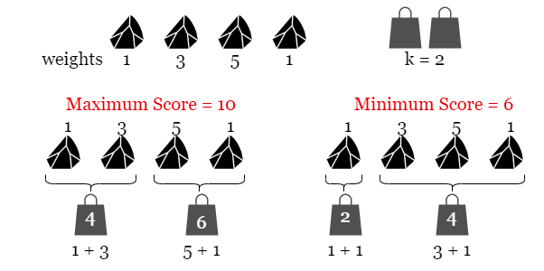
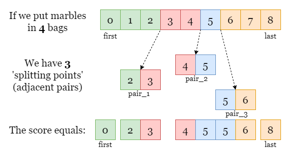
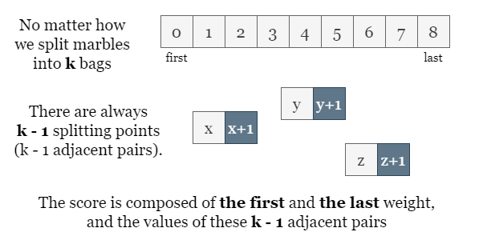
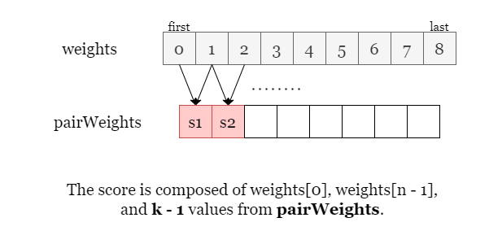

# Solution

## Overview
As shown in the picture below, we put `4` marbles in `k = 2` bags.

There are several ways to split marbles into two bags, we have shown two of them 
that bring the maximum cost `10` and the minimum cost `6`. 
Therefore, the difference between them is `10 - 6 = 4`.

## Approach: Sorting
### Intuition

Let's start with a brute-force approach. Since we are looking for the maximum score and the minimum score, 
we shall try iterating over all possible splits. 
Splitting n marbles into k consecutive groups is a typical sticks-and-stones problem that has as many 
as `C(nk)=n!/k!(n−k)!` solutions, thus it is impractical to iterate over all possibilities.

We might also think of using dynamic programming to solve the subproblem `(x, y)`: 
splitting previous x marbles into y bags, then moving on to the next larger subproblem `(x + 1, y)` 
or `(x, y + 1)`, until we reach the best solution of the entire problem `(n, k)`. 
However, given the size of the input array and the maximum value of `k`, 
dynamic programming brings at most `O(n^2)` time thus it won't pass the time limit.

In the picture below, we split the array into 4 subarrays (shown in different colors) and 
resulting in 3 splitting points, each of which is made of 2 adjacent ends.

**What is the score of this split?**

Since the score of a subarray only matters with its two ends, we can tell that the total score equals the sum 
of the first element, the last element, and the sum of every pair (two adjacent ends at each split).

In general, if we partition the array into `k` groups, 
we always make `k - 1` splitting points regardless of how the array is partitioned.

Now we know how to find the maximum score, by finding the sum of the largest `k - 1` pairs. 
Similarly, we can get the minimum score by finding the sum of the smallest `k - 1` pairs. 
This can be done by collecting every pair sum in an array `pairWeights` and sorting them.

### Algorithm
1. Collect the value of every pair from weights in the array `pairWeights`. 
2. Sort `pairWeights`. 
3. Get the sum of the `k - 1` largest pairs, and the sum of the `k - 1` smallest pairs. 
4. Return answer as the difference of the two sums in step 3.

### Complexity Analysis
Let `n` be the number of elements in the input array weights.

- Time complexity: `O(n⋅logn)`
  + We need to sort the `pairWeights`, the array of every pair value having `n - 1` elements, it takes `O(n⋅logn)` time.
  + We then traverse the sorted `pairWeights` and calculate the cumulative sum of the `k - 1` largest elements and 
  the sum of the `k - 1` smallest elements, this step takes `O(k)` time.
  + To sum up, the overall time complexity is `O(n⋅logn)`.

- Space complexity: `O(n)`
  + We create an auxiliary array `pairWeights` of size `n - 1` to store the value of all pairs.