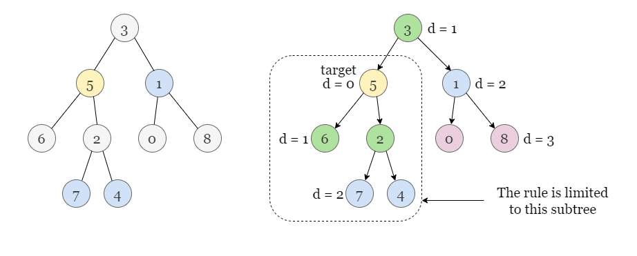
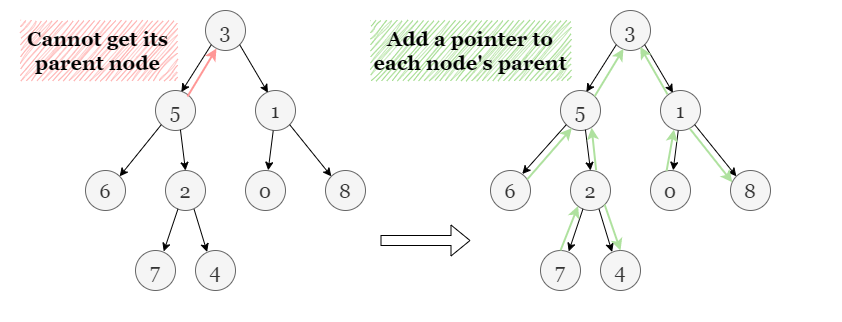
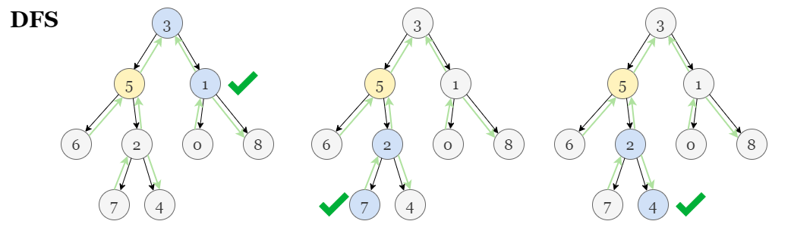

# Solution
## Overview
In the given tree, each node only has pointers to its left and right child nodes, 
making the typical tree traversal approach only applicable to the subtree rooted at the target node. 
We cannot access other parts of the tree beyond the subtree as we can't access the parent, 
which implies the need to establish additional connections beyond the child node pointers.

## Approach 1: Implementing Parent Pointers
### Intuition
If you are not familiar with depth-first (DFS) search, please refer to our explore cards 
[Depth-First Search Explore Card](https://leetcode.com/explore/learn/card/graph/619/depth-first-search-in-graph/). 
We will focus on the usage in this article and not the implementation details.
In this problem, nodes in the given binary tree only have pointers to the left and right children 
and we can't search in the ancestor nodes of target. 
We will implement a parent pointer to each node (apart from the root node) recursively.

In Python, we can add attributes (in our case a parent pointer) to an instance of a class at any time, 
even if the attribute is not defined in the class. However, this can also lead to mistakes and 
hard-to-debug errors. Consequently, this approach does not reflect good coding practices, 
but we have included it for completeness.

Now, we have created an undirected graph. We define a recursive function to explore nodes as far as possible 
along each branch. Upon reaching the end of the current branch, 
we backtrack to the next possible branch and continue exploring. 
Once we encounter an unvisited node, we take one of its neighbor nodes 
(left child, right child, or parent) as the next node on this branch. 
Recursively call the function to the next node and solve the subproblem. 
If we reach the end of this branch, we backtrack to the previous node and 
visit the next neighbor node, and repeat the process. If we reach a node with 
a distance of `k` to `target`, it denotes that this node is one of the destination nodes. 
Since continuing on with this branch leads to nodes with a distance larger than `k`, 
we will also backtrack to the previous node and try visiting the next neighbor node.

### Algorithm

1. Define a recursive function `add_parent(cur, parent)` to recursively add a parent pointer 
to node `cur`: If `cur` is not empty, add a pointer from cur to parent: `cur.parent = parent`. 
Then recursively call `add_parent` on the left and right children of `cur`:
   - `add_parent(cur.left, cur)`
   - `add_parent(cur.right, cur)`
2. Call `add_parent(root, None)` to add all parent pointers, note that the root node does not have a parent node.
3. Initialize an empty array `answer` and an empty hash set `visited`.
4. Define another recursive function `dfs(cur, distance)` to recursively find all nodes with 
a distance of k to node `target`:
   - If `root` is empty or has been visited before, return.
   - Add `cur` to `visited` so it won't be revisited later.
   - If `distance = k`, it means cur is one of the destination nodes, add it to `answer`, and return.
   - Recursively call `dfs` on the children and parent of `cur`.
5. Call `dfs(target, 0)` to find all destination nodes with a distance of `k`.
6. Return `answer` when the DFS is complete.
